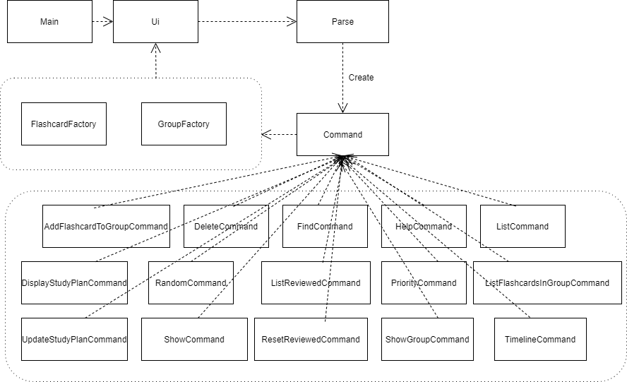
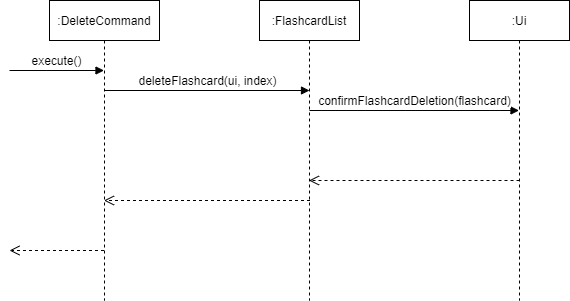
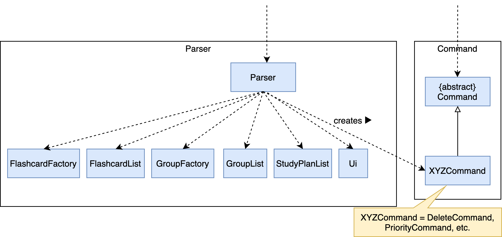
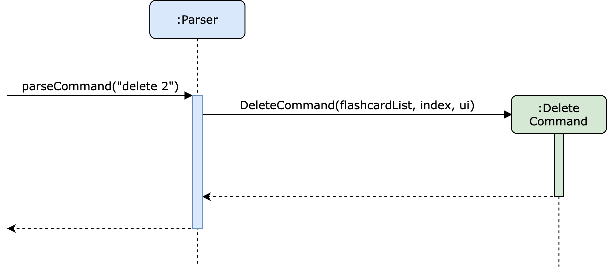
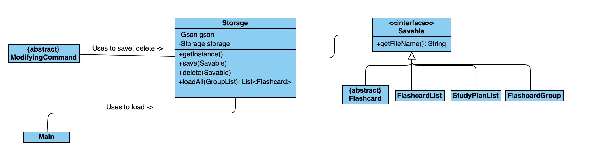
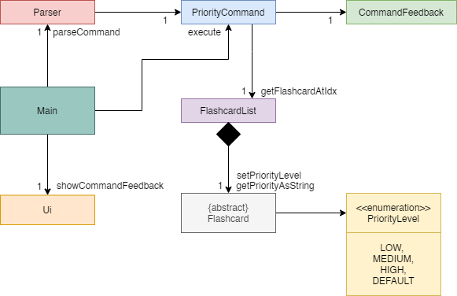
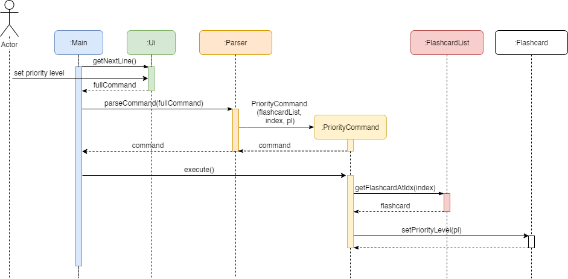
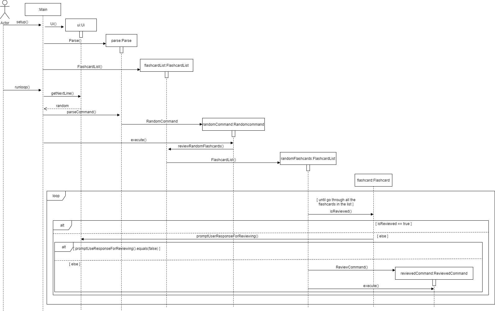

# Developer Guide

## Design

#### Ui Component

The structure of the Ui Component is illustrated in the following diagram:

API : `Ui.java`

1. The `Ui` class is used to communicate with users.
2. The `Ui` class depends on `Scanner` to get inputs from users.
3. The `Main` class uses `Ui#getNextLine()` to receive `commands` from users.
4. And `FlashcardFactory` and `GroupFactory` classes uses methods in `Ui` class to complete 
the execution of various commands.

Given below is the Sequence Diagram for interactions between the `Ui` and `FlashcardFactory` components to complete the
execution of an example command (`deleteCommand`).

#### Parser Component

The structure of the Parser Component is illustrated in the following diagram:

API : `Parser.java`

1. The `Main` class (not shown in the diagram above) uses the `Parser` class to parse the user command.
2. The `Parser` class depends on multiple classes including the `FlashcardFactory`, `FlashcardList`, `GroupFactory
`, `GroupList`, `StudyPlanList` and `Ui` classes to create a `Command` object from user input.
3. The resulting `Command` object which then can be executed by the `Main` class.

Given below is the Sequence Diagram for interactions between the `Parser` and `Command` components for the
`parseCommand` API call from `Main` class. We use the interaction between the `Parser` and `DeleteCommand` class as an example: 

#### Storage Component

The structure of the Storage component is illustrated in the folowing diagram.

The `Storage` class can be used to save, delete and load classes that implement the `Savable` interface.  
`Storage` is implemented using the Singleton pattern because there only should be one instance in the program at any given time.  
`Storage` used the Gson library to serialize/deserialize objects to/from JSON strings.  
  
The `ModifyinCommand` class uses the `Storage` class to save/delete objects when a change is made.  
The `Main` class uses the `Storage` object to load objects at the start of exectuion.

## Implementation

#### Set Priority Feature - Proposed Implementation

The Set Priority feature allows users to mark a flashcard with a specified priority level. The priority level is
then reflected when the user requests a list of existing flashcards.

`PriorityLevel` is stored as an enum with four fields: LOW, MEDIUM, HIGH and DEFAULT.

The feature implements the following operations:

- `Flashcard#setPriorityLevel()` - Sets a flashcard to a specified priority level (LOW/MEDIUM/HIGH).
- `Flashcard#getPriorityAsString()` - Return an icon indicating the flashcard's priority level.

The following class diagram shows the structures relevant to the Set Priority feature:

Given below is an example usage scenario and how the set priority mechanism behaves at each step.

Step 1. The user launches the application and creates a new `Flashcard` (of type Event, Person, or Other), 
with a default priority level of DEFAULT.

Step 2. The user executes `priority [flashcard index] [priority level]` command and the `setPriorityLevel` 
operation is invoked. Subsequently, the flashcard of specified index is retrieved from the main `FlashcardList` 
instance. Its priority level is set to the specified priority.

The following sequence diagram shows the relevant interactions behind `setPriorityLevel`:

#### Study Plan Feature - Proposed Implementation

The Study Plan feature is facilitated by `StudyPlanList`.

Internally, it implements a `TreeMap`, with date as key and the list of flashcard indexes to study as value. 
Key-value pairs in the `TreeMap` are sorted by dates.

It implements the following operations:

- `StudyPlanList#updateStudyPlan()` - Updates the study plan list.
- `StudyPlanList#deleteStudyPlan()` - Deletes a study plan from the study plan list.
- `StudyPlanList#getStudyPlanList()` - Gets the list of study plans.

Given below is an example usage scenario and how the study plan mechanism behaves at each step.

Step 1. The user launches the application and an empty `StudyPlanList` is initialized.

Step 2. The user executes `plan` command and the `updateStudyPlan` operation is invoked. The application prompts the
user for date and the corresponding list of flashcards indexes.

The following sequence diagram shows how the `updateStudyPlan` operation works:

Step 3. The user executes `delete-plan` command and the `deleteStudyPlan` operation is invoked. The application
prompts the user for the date for which the study plan is to be deleted.

The following sequence diagram shows how the `deleteStudyPlan` operation works:

Step 4. The user executes `show-plan` command and the `getStudyPlanList` operation is invoked. The application
displays the user's study plan list.

The following sequence diagram shows how the `getStudyPlanList` operation works:

#### Random Review Feature - Proposed Implementation

The random review mechanism is facilitated by `FlashcardList`.It stores an `List<Flashcard>` internally which contains
all the flashcards created by the user.

It implements the following operation:

- `FlashcardList#reviewRandomFlashcards()` -Randomize all the flashcards, then display the details of them one by one 
to the user. And update the review status of the flashcards corresponding to the user's' responses.

Given below is an example usage scenario and how the random review mechanism behaves at each step.

Step 1. The user launches the application for the first time. The `FlashcardsList` will be initialized with the empty 
flashcards list.

Step 2. The user executes `event/person/other commands` to add multiple flashcards to the flashcard list 
(The detailed implementation of creating flashcards explained in the Flashcard Creation Feature)

Step 3. The user executes `random command` and `reviewRandomFlashcards()` operation is invoked. The application prompts 
responses for each unreviewed flashcard that whether the user want to mark it as reviewed or not.

The following sequence diagram shows how the   `reviewRandomFlashcards()` operation works:

## Appendix A: Product Scope
### Target user profile

History Flashcard (HF) is for those who are studying history subjects to create flashcards which summarize 
the most important information for historical events, figures and artifacts. HF is optimized for those who 
prefer to use a simple Command Line Interface (CLI). 

### Value proposition

History is a subject that usually relies on heavy memorisation of a large amount of content. In order to 
make revision easier for history students, HF includes features that help with memory retention and organises 
information in a way that makes it convenient to review.

In HF, information can be entered in the form of flashcards with different fields, such as the name of the 
historical event/person, the relevant dates, and a summary. Flashcards can be categorised into user-defined groups
 to enable students to organise their knowledge better. Users can also create daily study plans.
 
In addition, the user can shuffle and display random flashcards for revision.

## Appendix B: User Stories

|Version| As a ... | I want to ... | So that I can ...|
|--------|----------|---------------|------------------|
|v1.0|student|add a Person flashcard|record the details about a historical figure|
|v1.0|student|add an Event flashcard|record the details about a historical event|
|v1.0|student|add an Other flashcard|record the details about any other historical item|
|v1.0|student|list all flashcards|get an overview of all my existing flashcards|
|v1.0|student|delete a flashcard|remove the flashcards that I no longer need|
|v1.0|student|view all the fields of a flashcard|review the details of a specific flashcard|
|v1.0|student|mark a flashcard as Reviewed|keep track of my learning progress|
|v1.0|student|assign priority to flashcards|identify the relative importance of flashcards for review|
|v1.0|student|view a timeline of all events and people|better organize my knowledge|
|v1.0|student|make groups for flashcards|group related flashcards together for more organized revision|
|v1.0|student|see all the commands available|find out what commands are available, and their format|
|v2.0|student|set a daily study plan|keep myself motivated to review flashcards every day|
|v2.0|student|view my daily study plan|keep track of my learning progresses|
|v2.0|student|list the flashcards which have been reviewed|keep track of my learning progress|
|v2.0|student|list all existing flashcard groups|view all the groups I have created|
|v2.0|student|list flashcards from a particular group|quickly identify the flashcards belonging to a group|
|v2.0|student|search for flashcards using a keyword|quickly find the flashcard I am looking for|
|v2.0|student|save flashcards to a storage file|flashcards are not lost when I exit the app|
|v2.0|student|read in flashcards from a storage file|flashcards can be loaded when I enter the app|
|v2.0|student|save flashcard groups to a storage file|groups are not lost when I exit the app|
|v2.0|student|read in flashcard groups from a storage file|groups can be loaded when I enter the app|
|v2.0|student|restrict the timeline to a fixed period|keep track of flashcards belonging to a certain time period|
|v2.0|student|shuffle and display random flashcards|test my knowledge using random flashcards|
|v2.0|student|reset all the flashcards as unreviewed|review flashcards multiple times
|v2.1|student|delete a study plan|remove outdated study plans
|v2.1|student|save my daily study plan to a storage file|study plans are not lost when I exit the app|
|v2.1|student|read in study plans from a storage file|study plans can be loaded when I enter the app|
|v2.1|student|list flashcards with a specified priority|focus on the flashcards of that importance level

## Appendix C: Non-Functional Requirements

1. Should work on any [mainstream OS](glossary) as long as it has Java 11 or above installed.
2. Should be tailored to history students' needs e.g. the need to keep track of dates or historical periods.

## Appendix D: Glossary

* *Mainstream OS* - Windows, Linux, Unix, OS-X

## Appendix E: Instructions for Manual Testing

Given below are instructions to test the app manually. Note that these instructions only provide a starting point for
testers to work on; testers are expected to do more exploratory testing.

### E.1. Launch and Shutdown

1. Launch
    - Download the jar file and copy into an empty folder.
    - Double-click the file to start the application or run the command `java -jar [path-to-history-flashcard-jar-file]` 
    from terminal.
2. Shutdown
    - Type in the `bye` to the application.

### E.2. Getting help

1. Getting help.
    - Test case: `help`
    
      Expected: Displays a list of commands available.

### E.3. Flashcard Creation

1. Adding an Event Flashcard.
    - Test case: `event`

      Expected: Being prompted to enter multiple fields of the flashcard.
       
      Enter some values for the fields.
       
      Expected: Receive a confirmation message from the application for successful flashcard creation.

2. Adding a Person Flashcard.
    - Test case: `person`

      Expected: Being prompted to enter multiple fields of the flashcard.
       
      Enter some values for the fields.
       
      Expected: Receive a confirmation message from the application for successful flashcard creation.

3. Adding an Other Flashcard which name does not duplicate the names of existing flashcards.
    - Prerequisites: List all flashcards using the `list` command and choose a new name for the new flashcard.
    
    - Test case: `other`
    
      Expected: Being prompted to enter multiple fields of the flashcard.
       
      Enter some values for the fields.
       
      Expected: Receive a confirmation message from the application for successful flashcard creation.
       
    - Test case: `other blabla`
    
      Expected: Same as above because `blabla` should be ignored.

4. Adding an Other Flashcard which name duplicates one of the names of existing flashcards.
    - Prerequisites: List all flashcards using the `list` command and choose a duplicate name for the new flashcard.
    
    - Test case: `other`
    
      Expected: Being prompted to enter multiple fields of the flashcard.
            
      Enter some values for the fields.
       
      Expected: Receive a confirmation message from the application for successful flashcard creation and a message
      saying that the created flashcard is not added due to the duplicate name. 

### E.4. Flashcard Basic Operations

1. Listing all flashcards.
    - Test case: `list` when there are flashcards in the application.
    
      Expected: Application lists all flashcards in the application.
    
    - Test case: `list` when there are no flashcard in the application.
    
      Expected: Receive a message indicating that the user has no flashcard at the moment.

2. Showing timeline.
    - Test case: `timeline`
      
      Expected: List all flashcards in order sorted by start/birth date.

    - Test case: `timeline 1900 2000`
    
      Expected: List all flashcards from the 1900 to 2000 period in order sorted by start/birth date.

3. Deleting a flashcard.
    - Prerequisites: List all flashcards using the `list` command and choose the index of a flashcard to delete
    
    - Test case: `delete 1`
    
       Expected: Receive a confirmation message from the application for successful flashcard deletion.
       
    - Test case: `delete`
    
       Expected: Receive a message from the application stating that the user should use correct input format.
       
    - Test case: `delete -1`
    
       Expected: Receive a message from the application stating that the user input contains invalid flashcard 
       index(es).

4. Showing a flashcard.
    - Test case: `show 1`
      
      Expected: Application shows all fields from the flashcard at index 1.

5. Finding flashcards with names containing a specific keyword.
    - Test case: `find war`
    
      Expected: Application displays all flashcards with names containing `war`.

### E.5. Flashcard Status Operations

1. Assigning priority to a flashcard.
    - Prerequisite: There are at least 2 flashcards in the application.
    
    - Test case: `priority 2 MEDIUM`
    
      Expected: Receive a message from the application stating that priority for flashcard at index 2 is updated to
      MEDIUM.

2. Listing flashcards of a specified priority.
    - Test case: `list-priority MEDIUM`
    
      Expected: Application lists all flashcards which match the MEDIUM priority level.

3. Marking flashcard as reviewed.
    - Prerequisite: There are at least 1 flashcard in the application.

    - Test case: `reviewed 1`
    
      Expected: Receive a message from the application stating that review status for flashcard at index 1 is
      updated to reviewed.

4. Listing reviewed flashcards.
    - Test case: `list-reviewed`
    
      Expected: Application lists all reviewed flashcards.

5. Resetting review status of all flashcards.
    - Test case: `reset-reviewed`
    
      Expected: Application resets status of all flashcards to un-reviewed.

### E.6. Flashcard Grouping

1. Making a flashcard group. 
    - Prerequisite: There are at least 1 flashcard in the application.

    - Test case: `group`
    
      Expected: Being prompted to enter multiple fields of the flashcard group.
       
      Enter some values for the fields.
       
      Expected: Receive a confirmation message from the application for successful flashcard group creation.

2. Adding a flashcard to a flashcard group.
    - Prerequisite: There are at least 1 flashcard in the application.

    - Test case: `add`
      
      Expected: Being prompted to enter multiple fields for adding a flashcard to a flashcard group.
             
      Enter some valid values for the fields.
      
      Expected: Receive a confirmation message from the application for successful addition of flashcard to
      the flashcard group.
      
3. Displaying flashcard groups.
    - Test case: `show-groups`
    
      Expected: Lists all existing flashcard groups.

4. Listing flashcards in a group.
    - Prerequisite: There are at least 1 flashcard group in the application.

    - Test case: `list-group 1`
      
      Expected: Lists all flashcards in the flashcard group at index 1.

5. Deleting flashcard group from the group list.
    - Prerequisite: There are at least 1 flashcard group in the application.

    - Test case: `delete-group 1`
    
      Expected: Receive a confirmation message from the application for successful deletion of the flashcard group at
      index 1.

### E.7. Study Plans

1. Creating a new study plan.
    - Prerequisite: There are at least 1 flashcard in the application.

    - Test case: `plan`

      Expected: Being prompted to enter multiple fields for adding a flashcard to a flashcard group.
             
      Enter some valid values for the fields.
   
      Expected: Receive a confirmation message from the application for successful update of study plan.

2. Displaying all study plans.
    - Test case: `show-plan`
    
      Expected: Application lists all study plans.

3. Deleting an existing study plan.
    - Test case: `delete-plan`
        
      Expected: Being prompted to enter the date for which the study plan is to be deleted.
      
      Enter a valid date.
      
      Expected: Receive a confirmation message from the application for successful deletion of study plan.

### E.8. Randomized Review

1. Displaying all flashcards in random order.

    - Test case: `random`
    
      Expected: Application shuffles and displays all the flashcards in a random order and prompts the user to give
      responses during the review.
      
      Enter responses.
      
      Expected: Finish reviewing all flashcards in random order.

### E.9 Saving and Loading

1. Saving
    - Test case: Add flashcards into the application and exit.
    
      Expected: Storage files generated under the `historyflashcards` directory.

2. Loading

    - Test case: Starts the application again.
    
      Expected: Saved contents under the `historyflashcards` directory are loaded into the application.
 