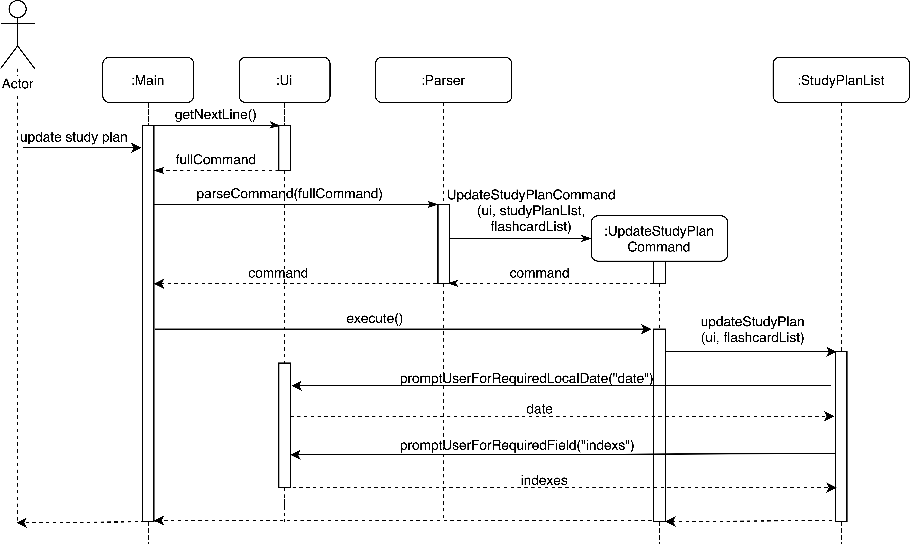
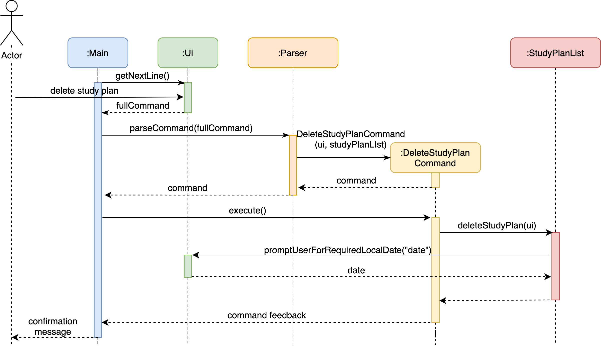
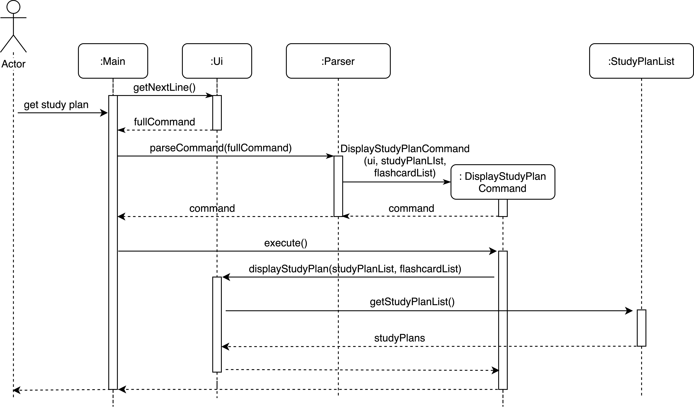

# Zhilin Huang - Project Portfolio Page

## PROJECT: History Flashcard

## Overview

History Flashcard (HF) is an app for history students to create flashcards which summarize the most important
 information for historical events, figures and artifacts. 
HF is optimized for those who prefer to use a simple Command Line Interface (CLI), and includes features that help
 with memory retention and make information convenient to review.

## Summary of Contributions

- **Code Contributed**: [Link](https://nus-cs2113-ay1920s2.github.io/tp-dashboard/#=undefined&search=zhilin-huang) to
 my code on tP Code Dashboard

- **Enhancements implemented**:
    1. Feature: List all flashcards
        - What it does: Allows users to input `list` to list all flashcards in the application.
        - Justification: This feature is needed for users to review all flashcards currently in the application.
        - Highlights: In the [pull request](https://github.com/AY1920S2-CS2113-T14-1/tp/pull/21) to implement this
        enhancement, I added the `Parser` class and the `Command` for all commands to inherit from and this roughly
        determines the structure of the code base. The `FlashcardList` class was implemented to handle all flashcards
        in the application.
    2. Feature: Delete a flashcard
        - What it does: Allows users to input `delete INDEX` to delete a flashcard.
        - Justification: This feature is needed for users to remove a flashcard that they no longer need.
        - Highlights: This feature was implemented in the same 
        [pull request](https://github.com/AY1920S2-CS2113-T14-1/tp/pull/21) as the 'List all flashcards'
        feature and deletion of the flashcards is handled by the `FlashcardList` class.
    3. Feature: Update study plan
        - What it does: Allows users to input `plan` and then prompt users to input the date for the plan and indexes of
        existing flashcards planned to study on that day.
        - Justification: This feature is needed for users to set their study plans for the flashcards so that they
        can better manage their studies.
        - Highlights: In the [pull request](https://github.com/AY1920S2-CS2113-T14-1/tp/pull/94) to implement this
        enhancement, I added the `StudyPlanList` class to handle all study plans in the application. Study plans
        are stored in a `TreeMap` with the date as key so that all entries are sorted by date.
    4. Feature: Display study plan
        - What it does: Allows users to input `show-plan` to display all study plans.
        - Justification: This feature is needed for users to view all the study plans they've added to the application.
        - Highlights: This feature was implemented in the same 
        [pull request](https://github.com/AY1920S2-CS2113-T14-1/tp/pull/94) as the 'Update study plan' feature and
        the list of all study plans is retrieved from the `StudyPlanList` class.
    5. Feature: Delete study plan
        - What it does: Allows users to input `delete-plan` to delete a study plan for the study plan list.
        - Justification: This feature is needed for users to delete a study plan that they no longer need.
        - Highlights: In the [pull request](https://github.com/AY1920S2-CS2113-T14-1/tp/pull/173) to implement this
         enhancement, I added a method in the `StudyPlanList` class to handle the deletion of study plans.
    6. Feature: List all reviewed flashcards
        - What is does: Allows users to input `list-reviewed` to view all reviewed flashcards in the application.
        - Justification: This feature is needed for users to keep track of what flashcards have been reviewed.
        - Highlights: In the [pull request](https://github.com/AY1920S2-CS2113-T14-1/tp/pull/95) to implement this
        enhancement, a method was added to the `FlashcardList` class to get all reviewed flashcards from the
        flashcard list. The index of each flashcard in the flashcard list is also printed out for the users.
    7. Feature: Search for all flashcards with names containing a specific keyword
        - What is done: Allows users to input `find KEYWORD` to display all flashcards with names containing the KEYWORD.
        - Justification: This feature is needed for users to conveniently search for flashcards when they cannot
        remember the index of the flashcard(s) they are looking for.
        - Highlights: This feature was implemented in the same 
        [pull request](https://github.com/AY1920S2-CS2113-T14-1/tp/pull/95) as the 'List all reviewed flashcards' 
        feature. A method was added to the `FlashcardList` class to get all flashcards with names containing the
        specified keyword from the flashcard list. The index of each flashcard in the flashcard list is also printed
        out for the users.

- **Contributions to User Guide**:
    1. Updated User Guide for all features implemented in v1.0 in the pull request 
    [here](https://github.com/AY1920S2-CS2113-T14-1/tp/pull/45).
    2. Added description for the `find KEYWORD` and `list-reviewed`.
    3. Added description for the Study Plans related features.

- **Contributions to the Developer Guide**:
    1. Added description for the Study Plan related features.
    2. Added description for the Parser component.
    3. Added Instructions for Manual Testing.

- **Review/mentoring contributions**: I actively reviewed pull requests from my teammates. For example,
[#14](https://github.com/AY1920S2-CS2113-T14-1/tp/pull/14), 
[#25](https://github.com/AY1920S2-CS2113-T14-1/tp/pull/25), 
[#28](https://github.com/AY1920S2-CS2113-T14-1/tp/pull/28), 
[#31](https://github.com/AY1920S2-CS2113-T14-1/tp/pull/31),
[#36](https://github.com/AY1920S2-CS2113-T14-1/tp/pull/36),
[#43](https://github.com/AY1920S2-CS2113-T14-1/tp/pull/43),
[#62](https://github.com/AY1920S2-CS2113-T14-1/tp/pull/62),
[#70](https://github.com/AY1920S2-CS2113-T14-1/tp/pull/70),
[#71](https://github.com/AY1920S2-CS2113-T14-1/tp/pull/71),
[#74](https://github.com/AY1920S2-CS2113-T14-1/tp/pull/74),
[#98](https://github.com/AY1920S2-CS2113-T14-1/tp/pull/98),
[#105](https://github.com/AY1920S2-CS2113-T14-1/tp/pull/105),
[#109](https://github.com/AY1920S2-CS2113-T14-1/tp/pull/109),
[#113](https://github.com/AY1920S2-CS2113-T14-1/tp/pull/113),
[#136](https://github.com/AY1920S2-CS2113-T14-1/tp/pull/136).
- **Contributions beyond the project team**: I actively initialized or participated in forum discussions. For example,
[#21](https://github.com/nus-cs2113-AY1920S2/forum/issues/21),
[#26](https://github.com/nus-cs2113-AY1920S2/forum/issues/26),
[#31](https://github.com/nus-cs2113-AY1920S2/forum/issues/31),
[#56](https://github.com/nus-cs2113-AY1920S2/forum/issues/56),
[#69](https://github.com/nus-cs2113-AY1920S2/forum/issues/69),
[#83](https://github.com/nus-cs2113-AY1920S2/forum/issues/83).

- **Other contributions**:
    - Managed [releases](https://github.com/AY1920S2-CS2113-T14-1/tp/releases) `v1.0`, `v2.0` on GitHub.
    - Helped maintain the [issue tracker](https://github.com/AY1920S2-CS2113-T14-1/tp/issues).
    - Reported [bugs and suggestions](https://github.com/Zhilin-Huang/ped/issues) for other project teams.

## Contributions to the User Guide (Extracts)

An example of my contribution to the User Guide is extracted as follows:

### 3.7. Study Plans
#### 3.7.1. Creating a new study plan: `plan`

Creates a new study plan by specifying date and indexes of existing flashcards.

Format: `plan`

The application will then prompt the user to enter the following fields:

- `DATE`: the date which the user want to set a study plan for
- `FLASHCARD_INDEXES`: indexes of the flashcards in the study plan

Example of usage:

```
plan
01/01/2020
1 3
```

#### 3.7.2. Displaying all study plans: `show-plan`

Lists all study plans.

Format: `show-plan`

#### 3.7.3. Deleting a study plan: `delete-plan`

Deletes a specified study plan. 
The user will be prompted to enter the date of the study plan they wish to delete.

Format: `delete-plan`

The application will then prompt the user to enter the following fields:

- `DATE`: the date which the user want to delete study plan

Example of usage:

```
delete-plan
01-01-2020
```

## Contributions to the Developer Guide (Extracts)

An example of my contribution to the Developer Guide is extracted as follows:

#### Study Plan Feature - Proposed Implementation

The Study Plan feature is facilitated by `StudyPlanList`.

Internally, it implements a `TreeMap`, with date as key and the list of flashcard indexes to study as value. 
Key-value pairs in the `TreeMap` are sorted by dates.

It implements the following operations:

- `StudyPlanList#updateStudyPlan()` - Updates the study plan list.
- `StudyPlanList#deleteStudyPlan()` - Deletes a study plan from the study plan list.
- `StudyPlanList#getStudyPlanList()` - Gets the list of study plans.

Given below is an example usage scenario and how the study plan mechanism behaves at each step.

Step 1. The user launches the application and an empty `StudyPlanList` is initialized.

Step 2. The user executes `plan` command and the `updateStudyPlan` operation is invoked. The application prompts the
user for date and the corresponding list of flashcards indexes.

The following sequence diagram shows how the `updateStudyPlan` operation works:



Step 3. The user executes `delete-plan` command and the `deleteStudyPlan` operation is invoked. The application
prompts the user for the date for which the study plan is to be deleted.

The following sequence diagram shows how the `deleteStudyPlan` operation works:



Step 4. The user executes `show-plan` command and the `getStudyPlanList` operation is invoked. The application
displays the user's study plan list.

The following sequence diagram shows how the `getStudyPlanList` operation works:



